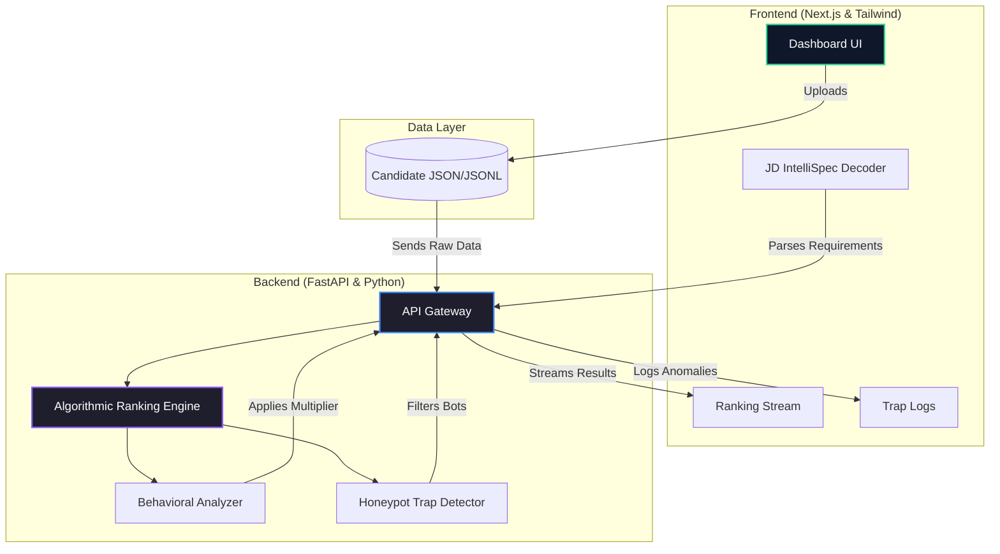

<div align="center">
  

  # 🧠 Sarvam Recruiter (IntelliSpec)
  **Next-Generation Recruitment & Predictive Ranking Platform**

  [](https://nextjs.org/)
  [](https://www.typescriptlang.org/)
  [](https://fastapi.tiangolo.com/)
  [](https://tailwindcss.com/)
  
  <p align="center">
    A futuristic platform designed to combat "Keyword Stuffing" and algorithmically surface the most authentic, high-quality candidates through Behavioral Signals and Honeypot Traps.
  </p>
</div>

---

## 🏗️ System Architecture

The platform operates on a decoupled architecture, ensuring rapid UI responsiveness while the heavy algorithmic processing runs asynchronously on the backend.



---

## ⚡ Core Processing Flow

Understanding how a candidate is scored in real-time. The final score is not just a keyword match—it is a sophisticated, 3-stage computational pipeline.

```mermaid
sequenceDiagram
    participant R as Recruiter
    participant FE as Frontend Client
    participant BE as Ranking Engine
    participant DB as JSON Data Stream

    R->>FE: Uploads Job Description
    FE->>FE: Auto-Parses JD (IntelliSpec)
    FE->>BE: Triggers Rank Request (with parsed JD)
    BE->>DB: Fetch Candidate Array
    DB-->>BE: Candidate Pool
    
    rect rgb(20, 30, 40)
        Note over BE: Phase 1: Core Parsing
        BE->>BE: Match Tech Skills & Experience
    end
    
    rect rgb(40, 20, 30)
        Note over BE: Phase 2: Trap Detection
        BE->>BE: Filter 'Honeypots' (Fake keywords)
    end
    
    rect rgb(20, 40, 30)
        Note over BE: Phase 3: Behavioral Modifiers
        BE->>BE: Multiply by Response Rate & Last Login
    end
    
    BE-->>FE: Returns Ranked Stream & Metadata
    FE-->>R: Visualizes Top Candidates in Dashboard
```



---

## ✨ Key Features

- **📄 IntelliSpec JD Engine:** Drop a Job Description (.txt, .pdf, .docx, .json) and watch the system instantly extract role requirements, compute Algorithmic Discovery Weightings, and decode the underlying "hidden signals" of the job.
- **⚡ Predictive Ranking Stream:** Automatically streams ranked candidates based on the active Job Specification. Adjust the top candidate count on the fly (Top 10, 50, 100, etc.).
- **🛡️ Synthetic Honeypot Purging:** Identifies and filters out candidates who artificially inflate their profiles with automated buzzwords and impossible credentials.
- **📊 Deep Score Breakdowns:** 100% transparent scoring. See exactly how the algorithm arrived at a final score using factors like *Technical Depth*, *Experience Fit*, *Penalized Core*, and a proprietary *Behavioral Modifier*.
- **🕵️ Trap Logs:** A dedicated dashboard for recruiters to review why specific candidates were flagged and filtered by the validation system.

---

## 📂 Repository Structure

```text
c:\India_Runs_Data\
├── backend/
│   ├── main.py              # FastAPI Application & Endpoints
│   ├── algorithms.py        # Core Ranking & Penalty Logic
│   └── requirements.txt     # Python Dependencies
└── frontend/
    ├── src/
    │   ├── app/             # Next.js App Router (Dashboard, Logs, Settings)
    │   ├── components/      # React Components (RankingTable, JobSpecPanel)
    │   └── types/           # TypeScript Interfaces
    ├── public/              # Static Assets
    ├── tailwind.config.ts   # Custom Glassmorphism Theme
    └── package.json         # Node Dependencies
```

---

## 🚀 Getting Started

### Prerequisites
- **Node.js** (v18+)
- **Python** (3.9+)

### 1. Setup the Backend
Navigate to the backend directory, install the required Python packages, and start the FastAPI server:

```bash
cd backend
pip install -r requirements.txt
python -m uvicorn main:app --reload --port 8000
```
> **Note:** The backend will run locally on `http://localhost:8000`

### 2. Setup the Frontend
Navigate to the frontend directory, install NPM dependencies, and start the development server:

```bash
cd frontend
npm install
npm run dev
```
> **Note:** The frontend will be accessible at `http://localhost:3000`

---

## 💡 Usage Guide

1. **Upload Candidates:** On the main dashboard, click the "Upload Candidates JSON" button. Choose your candidate `.json` or `.jsonl` file. The platform parses and securely caches it in memory.
2. **Upload Job Description:** Drag and drop a JD into the "Active Job Specification" panel.
3. **Watch the Magic:** The platform instantly decodes your JD, evaluates it against your candidates, and streams the top results into the Ranking Table.
4. **View Deep Insights:** Click any candidate row to open their profile drawer, visualizing their 8-factor score breakdown, behavioral signals, and contact info.

---

## 🔒 Configuration

Configure your environment variables in the frontend by modifying the `.env.local` file:
```env
NEXT_PUBLIC_API_URL=http://localhost:8000
```

<br/>
<p align="center">
  <i>Designed & Built for the future of intelligent recruitment.</i>
</p>
